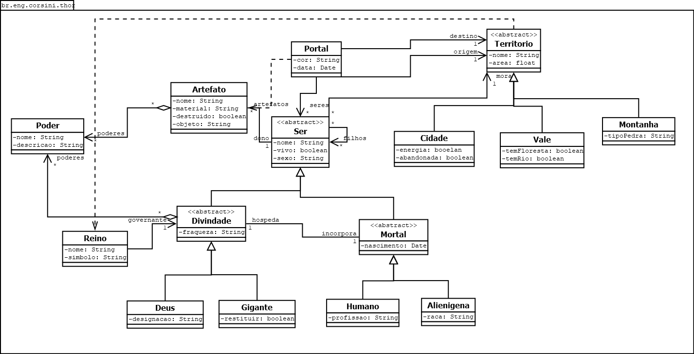

# ⚡ Software Project


Welcome to **ECOT12 Software Project**, a learning project developed in **Java**.  
This repository was created as a **first Java project**, aiming to explore **Object-Oriented Programming (OOP)** concepts and practice fundamental software development skills. 

---

## 📚 Project Overview

- Built with **Java** (Maven project structure).
- First steps in **software modeling** with diagrams.
- Includes **source code, UML diagrams, and project configuration**.

---

## 📂 Repository Structure

```plaintext
Thor-Verse/
├── src/
│   └── main/
│       └── java/
│           └── br/
│               └── eng/
│                   └── corsini/
│                       └── thor/     # Java classes of the project
├── .gitignore                        # Git ignore file
├── README.md                         # Project documentation
├── pom.xml                           # Maven configuration file
├── thor-verse-diagram.dia            # Diagram source file (Dia)
└── thor-verse-diagram.png            # Exported diagram image
```

---

## 🛠️ Tools & Technologies

- **Java** (main programming language)
- **Maven** (dependency and build management)
- **Dia** (diagram design tool)
- **Git/GitHub** (version control and hosting)

---

## 🖼️ Project Diagram

The following diagram represents the structure of the project: (will be constantly updated)



---

## 🚀 Getting Started

1. Clone the repository:
   ```bash
   git clone https://github.com/your-username/thor-verse.git
   cd thor-verse
   ```

2. Build the project using Maven:
   ```bash
   mvn clean install
   ```

3. Run the application (example):
   ```bash
   mvn exec:java -Dexec.mainClass="br.eng.corsini.thor.Main"
   ```

---

## 🎯 Learning Goals

- Understand the basics of **Java programming**.
- Apply **object-oriented principles** (Encapsulation, Inheritance, Polymorphism, Abstraction).
- Learn to structure a project with **Maven**.
- Gain practice in **diagramming and documentation**.

---

## ✨ Author

👤 **Pedro Corsini**  
📌 First steps into the Java world!

---

⭐ If you like this project, consider giving it a star!  
